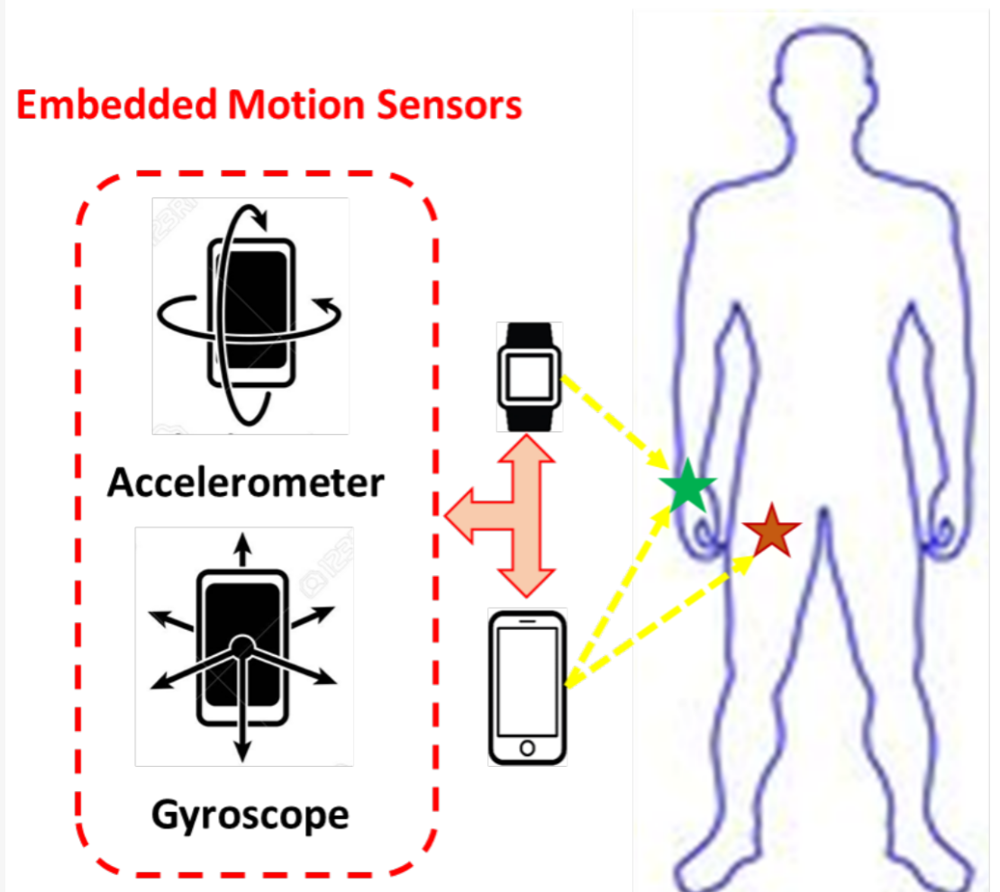
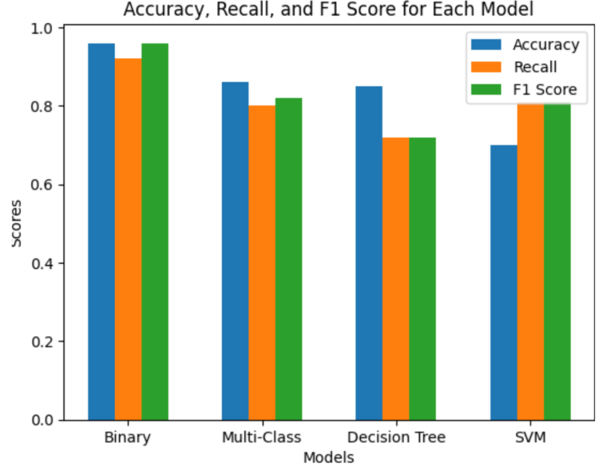

# Activity Recognition Using Various Sensors

### Team Mates (Machine Learning Course Project)  
- Muhammad Amir      - BSE F21 M013
- Muhammad Saadullah - BSE F21 M037
- Maryam Iqbal       - BSE F21 M035 

## Overview
This project aims to figure out what the person is doing at a specific time. The data is collected from the 9 sensors attatched to different devices (SmartWatch, Glasses, and SmartPhone).We employed different models and compared their results.The details of results is provided below. 

We’ve experimented with four ML models for classification. First of all we used logistic regression classifier for 2 classes. Then, we used the neural networks with 5 number of classes for multi-class classification. In the end, we used random forest and SVM algorithm for better performance. 

### Challenge We faced
The number of input featuers inceased as we planned to classify 55 activities. So, we decided to eliminate some featues and tried to do the feature engineering to only include the features that really mattered. However, it was hard to figure out manually. Ultimately, we employed the PCA algorithm to automatically select the most relevant features.It really improved the model's performing, allowing it to focus on relvant features only.

### Key Take-away

Support Vector Machine turned out to be the best model as it performed really well on 55 classes. The accuracy of binary classifier was highest but it only handled 2 classes.

### The detailed information is provided in the documentation file of the project.